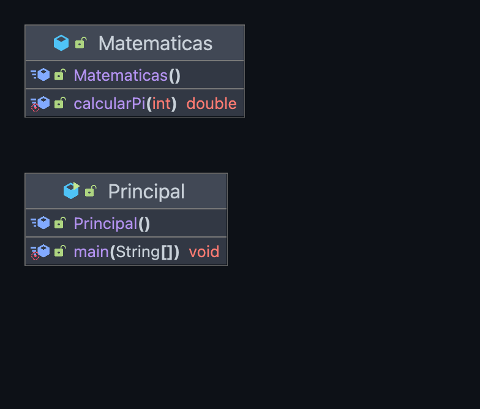
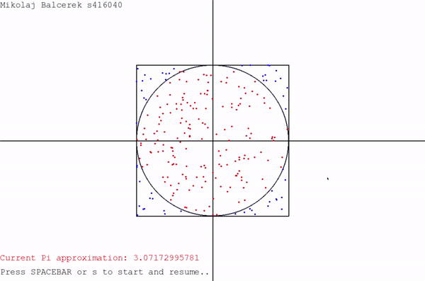

Copyright [2023] [Daniel Fernández López]
Licensed under the Apache License, Version 2.0 (the "License");
you may not use this file except in compliance with the License.
You may obtain a copy of the License at

            http://www.apache.org/licenses/LICENSE-2.0

 Unless required by applicable law or agreed to in writing, 
 software distributed under the License is distributed on an
"AS IS" BASIS, WITHOUT WARRANTIES OR CONDITIONS OF ANY KIND, 
 either express or implied. See the License for the specific
language governing permissions and limitations under theLicense.

# MontecarloPi22-23 

## Descripción:

Práctica 1: Montecarlo Pi 22-23

Este programa ha sido diseñado para poder realizar una aproximación al número Pi a partir del método de Monte Carlo
de manera recursiva.

La recursividad es una técnica mediante la cual una función se llama a sí misma, tratando de dividir problemas complejos
en problemas más simples.

El método de Monte Carlo consiste en inscribir una circunferencia dentro un cuadrado, (siendo el diámetro de la circunferencia
igual que uno de los lados del cuadrado) y mediante la generación de puntos aleatorios sobre la superficie dibujada se establece
una relación entre los puntos interiores (aciertos) y puntos totales; con la que se podrá llevar a cabo la aproximción al número Pi.

En este programa hemos definido las siguientes variables:
- n: número de intentos.
- aciertos: cuantos puntos caen dentro de la circunferencia.
- pi: aproximación al número Pi.
- x: coordenada x del punto generado.
- y: coordenada y del punto generado.
- areaCirculo: área del círculo inscrito.
- areaCuadrado: área del cuadrado.


## Comandos:

**NOTA:** Debido a la estructura del proyecto, es necesario ejecutar los comandos desde la carpeta raíz del proyecto, es decir,
la carpeta Pi, donde se encuentra el archivo makefile.

* Ejecución código:
```shell
java -jar principal.jar  
```

* Aunque también es posible ejecutar el programa mediante el comando:

```shell
make ejecutar
```

* Compilación código:
```shell
make compilar
```

* Creación jar:
```shell
make jar 
```

* Creación Javadoc:
```shell
make javadoc
```
## Diagrama de clases:



## Animación:
